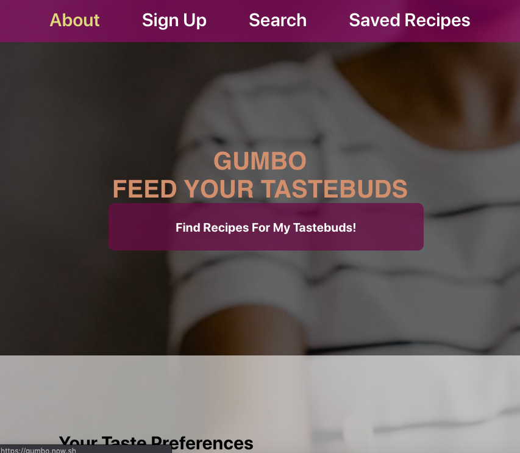
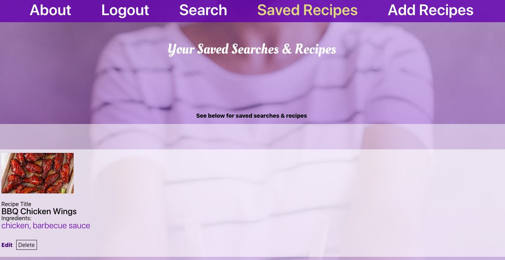
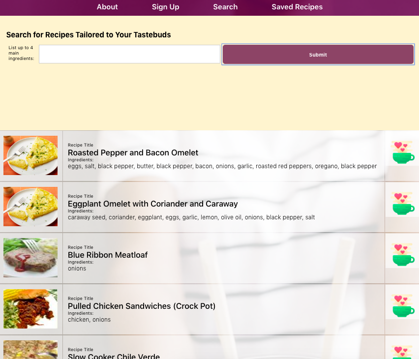
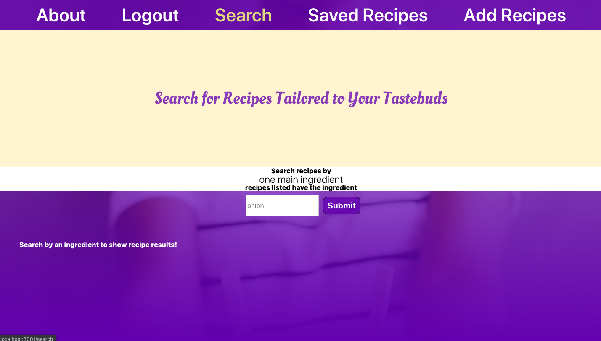
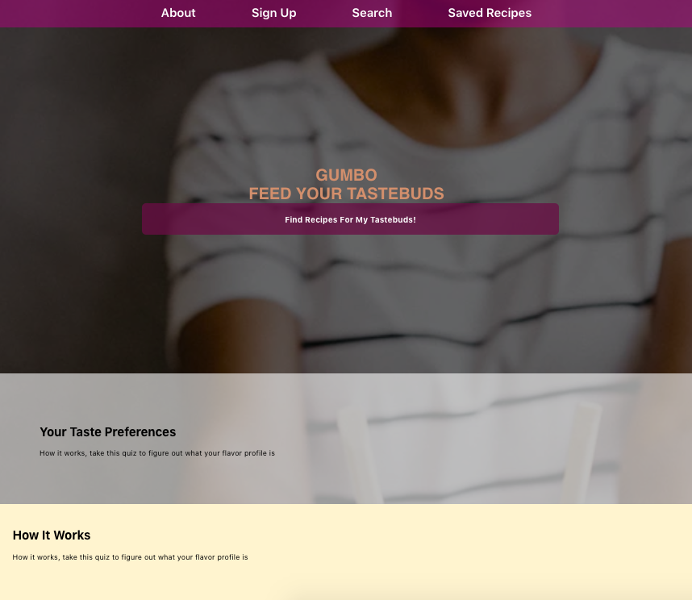
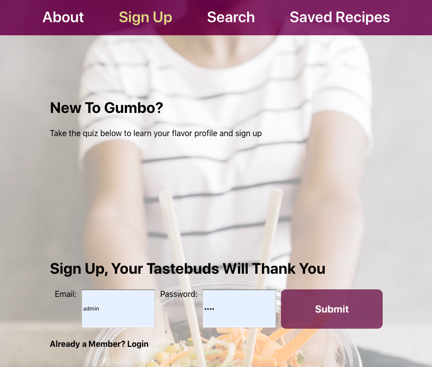

# Gumbo Recipe Search + Save Capstone
Gumbo allows users to search for and create an index of recipes to use for later.

## Live Link
[https://gumbo.now.sh/](https://gumbo.now.sh/)
#### Note: A demo user account is provided to explore the app (you can still choose to create a new account if you wish)
    username: admin
    password: pass

## Screenshots
### About - landing page

### Add Recipes

### Search

### Search

### Signup 

### 

## API Documentation
[https://github.com/QueenShabazz/gumbo-api/](https://github.com/QueenShabazz/gumbo-api/)

## Tech Stack
* HTML5
* CSS3
* ES6
* React.JS

## Production
* Deployed via Zeit

## Setup

To setup the application

1. Fork and clone the project to your machine
2. `npm install`. This will also install the application *Cypress.io* for running browser integration tests

The project expects you have the Spaced repetition API project setup and running on http://localhost:8000.

## Running project

This is a `create-react-app` project so `npm start` will start the project in development mode with hot reloading by default.

